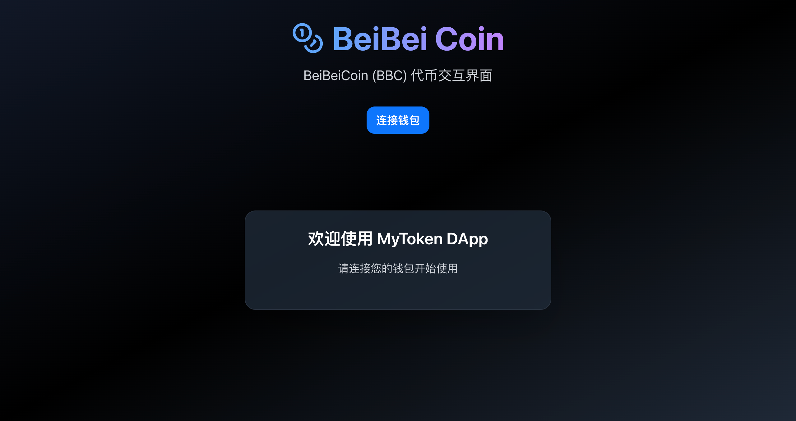
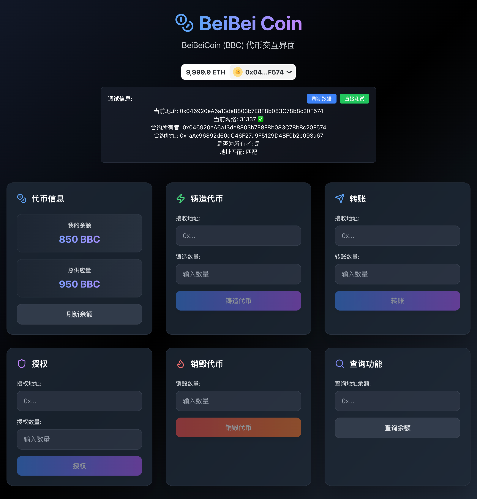

# BeiBeiCoin (BBC) DApp 🪙

[](https://opensource.org/licenses/MIT)
[](https://hardhat.org/)
[](https://reactjs.org/)
[](https://vuejs.org/)
[](https://docs.ethers.org/)

👆 [点击查看中文文档](./README.md)

> A full-featured ERC-20 token DApp with minting, transfer, approval, and burning capabilities, supporting both React and Vue frontend versions

## 📖 Project Overview

BeiBeiCoin (BBC) is an Ethereum-based ERC-20 token project that provides complete smart contracts and modern frontend interfaces. The project includes:

- **Smart Contracts**: Solidity-based ERC-20 token contract with minting and burning capabilities
- **React Frontend**: Modern Web3 interface built with React 19 + RainbowKit + Wagmi v2
- **Vue Frontend**: Native Web3 connection interface built with Vue 3 + ethers.js v6
- **Local Development**: Complete Hardhat development environment configuration

<!-- Project demo screenshots placeholder -->

## 🖼️ Project Screenshots

- Main Dashboard

[](https://github.com/your-username/hardhat-project)

- Token Operations Interface

[](https://github.com/your-username/hardhat-project)

## ✨ Key Features

### 🔒 Smart Contract Features

- ✅ Standard ERC-20 token implementation
- ✅ Owner-only token minting
- ✅ Token burning functionality
- ✅ Transfer and approval mechanisms
- ✅ Complete event logging

### 🎨 Frontend Features

- ✅ Dual frontend support (React + Vue)
- ✅ Modern responsive UI design
- ✅ Real-time balance updates
- ✅ Complete error handling
- ✅ Automatic network detection and switching
- ✅ Transaction status tracking

### 🛠️ Development Tools

- ✅ Hardhat local development network
- ✅ Automated test suite
- ✅ Contract deployment scripts
- ✅ TypeScript support
- ✅ Hot reload development environment

## 🏗️ Technical Architecture

### Smart Contract Layer

```
MyToken.sol (ERC-20)
├── Minting functionality (owner only)
├── Transfer functionality
├── Approval mechanism
├── Burning functionality
└── Balance queries
```

### React Stack

```
React 19 + TypeScript
├── RainbowKit (wallet connection)
├── Wagmi v2 (Web3 Hooks)
├── Viem (Ethereum client)
├── TanStack Query (data fetching)
├── Tailwind CSS (styling)
└── Lucide React (icons)
```

### Vue Stack

```
Vue 3.5.17 + TypeScript
├── ethers.js v6.15.0 (Web3 library)
├── BrowserProvider (wallet connection)
├── Vite 6.x (build tool)
├── Tailwind CSS (styling)
└── Composition API (state management)
```

## 🚀 Quick Start

### Prerequisites

- Node.js >= 18.0.0
- npm >= 8.0.0
- MetaMask wallet extension

### 1. Clone the Project

```bash
git clone <repository-url>
cd hardhat-project
```

### 2. Install Dependencies

```bash
# Install main project dependencies
npm install

# Install React frontend dependencies
cd frontend-react
npm install
cd ..

# Install Vue frontend dependencies
cd frontend-vue
npm install
cd ..
```

### 3. Start Local Blockchain

```bash
# Start Hardhat local network (keep running)
npx hardhat node
```

### 4. Deploy Smart Contract

```bash
# Open new terminal, deploy contract to local network
npx hardhat run scripts/fixed-addr-deploy-and-test.js --network localhost
```

### 5. Configure MetaMask

1. Add local network:

   - Network Name: `Hardhat Local`
   - RPC URL: `http://127.0.0.1:8545`
   - Chain ID: `31337`
   - Currency Symbol: `ETH`

2. Import test accounts (see `ACCOUNTS.md` for private keys)

### 6. Start Frontend Application

#### React Version

```bash
cd frontend-react
npm run dev
```

Visit: http://localhost:5173

**React Version Features:**

- 🎨 Modern UI design
- 🔗 RainbowKit wallet connection
- ⚡ Wagmi v2 high-performance Hooks
- 🔄 Real-time data synchronization
- 📱 Perfect responsive design

#### Vue Version

```bash
cd frontend-vue
npm run dev
```

Visit: http://localhost:5174

**Vue Version Features:**

- 🛠️ Native ethers.js v6 integration
- 🔧 Direct BrowserProvider connection
- 🐛 Debugged and fixed stable version
- 💡 Composition API state management
- 🎯 Focus on core Web3 functionality

## 📚 Usage Guide

### Connect Wallet

1. Click "Connect Wallet" button
2. Select MetaMask
3. Confirm connection and switch to Hardhat local network

### Token Operations

#### 🪙 Mint Tokens (Contract Owner Only)

1. Enter recipient address
2. Enter mint amount
3. Click "Mint Tokens"
4. Confirm transaction in MetaMask

#### 💸 Transfer Tokens

1. Enter recipient address
2. Enter transfer amount
3. Click "Transfer"
4. Confirm transaction

#### 🛡️ Approve Tokens

1. Enter spender address
2. Enter approval amount
3. Click "Approve"
4. Confirm transaction

#### 🔥 Burn Tokens

1. Enter burn amount
2. Click "Burn Tokens"
3. Confirm transaction

#### 🔍 Query Balance

1. Enter address to query
2. Click "Query Balance"
3. View results

## 🧪 Testing & Development

### Run Tests

```bash
# Run smart contract tests
npx hardhat test

# Run specific test file
npx hardhat test test/MyTokenTest.js
```

### Redeploy Contract

Note: This project's frontend requires a fixed contract address. It's recommended to use the `fixed-addr-deploy-and-test.js` script to avoid having to modify the frontend connection address. Before redeploying the contract, stop the hardhat node first.

```bash
# Deploy with fixed contract address (recommended)
npx hardhat run scripts/fixed-addr-deploy-and-test.js --network localhost

# Standard deployment
npx hardhat run scripts/deploy.js --network localhost
```

## 📁 Project Structure

```
hardhat-project/
├── contracts/                 # Smart contracts
│   └── MyToken.sol            # ERC-20 token contract
├── scripts/                   # Deployment scripts
│   ├── deploy.js              # Standard deployment script
│   └── fixed-addr-deploy-and-test.js  # Fixed address deployment script
├── test/                      # Contract tests
│   └── MyTokenTest.js         # Token contract tests
├── frontend-react/            # React frontend
│   ├── src/
│   │   ├── components/        # React components
│   │   ├── config/           # Wagmi configuration
│   │   └── ...
│   └── package.json
├── frontend-vue/              # Vue frontend
│   ├── src/
│   │   ├── components/        # Vue components
│   │   ├── composables/       # Vue Composables
│   │   ├── utils/            # Web3 utilities
│   │   └── ...
│   └── package.json
├── ignition/                  # Hardhat Ignition modules
├── ACCOUNTS.md               # Test account information
├── TROUBLESHOOTING.md        # Troubleshooting guide
├── CLAUDE.md                 # Project development log
└── README.md                 # Project documentation
```

## ⚠️ Troubleshooting

### Common Issues

#### 1. MetaMask Connection Failed

```bash
# Solutions
1. Ensure MetaMask is installed and unlocked
2. Check network configuration is correct (localhost:8545, Chain ID: 31337)
3. Clear MetaMask cache and reconnect (restart browser, force cache clear seems ineffective)
```

#### 2. Contract Interaction Failed

```bash
# Solutions
1. Confirm Hardhat network is running
2. Check contract is properly deployed
3. Verify account has enough ETH to pay gas fees
```

#### 3. Vue Version ethers.js Issues

```bash
# Fixed Issues
1. ❌ Cannot read private member #notReady
   ✅ Use BrowserProvider instead of provider.ready

2. ❌ Contract function call failed
   ✅ Use standard ERC20 function names (balanceOf, totalSupply)
```

For detailed troubleshooting guide, see [TROUBLESHOOTING.md](./TROUBLESHOOTING.md)

## 🔧 Configuration

### Contract Configuration

- **Contract Address**: `0x1aAc96892d60dC46F27a9F5129D4BF0b2e093a67` (fixed address)
- **Token Name**: `BeiBeiCoin`
- **Token Symbol**: `BBC`
- **Decimals**: `18`
- **Network**: Hardhat Local (Chain ID: 31337)

### Network Configuration

```javascript
// hardhat.config.js
networks: {
  localhost: {
    url: "http://127.0.0.1:8545",
    chainId: 31337
  }
}
```

## 🤝 Contributing

1. Fork the project
2. Create feature branch (`git checkout -b feature/AmazingFeature`)
3. Commit changes (`git commit -m 'Add some AmazingFeature'`)
4. Push to branch (`git push origin feature/AmazingFeature`)
5. Create Pull Request

### Development Standards

- Use TypeScript for type-safe development
- Follow ESLint code standards
- Write comprehensive unit tests
- Update relevant documentation

## 📄 License

This project is open source under the MIT License - see the [LICENSE](LICENSE) file for details

## 🙏 Acknowledgments

- [Hardhat](https://hardhat.org/) - Ethereum development environment
- [OpenZeppelin](https://openzeppelin.com/) - Smart contract library
- [ethers.js](https://docs.ethers.org/) - Ethereum JavaScript library
- [RainbowKit](https://www.rainbowkit.com/) - React Web3 connection components
- [Wagmi](https://wagmi.sh/) - React Hooks for Ethereum
- [Vue.js](https://vuejs.org/) - Progressive JavaScript framework
- [Tailwind CSS](https://tailwindcss.com/) - Utility-first CSS framework

## 📞 Contact

For questions or suggestions, please:

1. Submit an [Issue](../../issues)
2. Start a [Discussion](../../discussions)
3. Create a [Pull Request](../../pulls)

---

**⭐ If this project helps you, please give it a Star!**

---